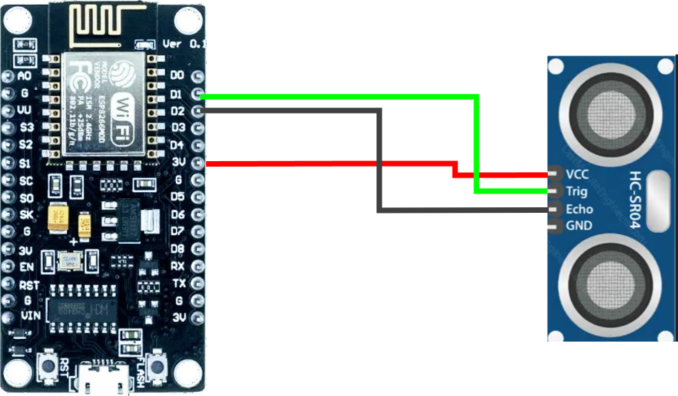
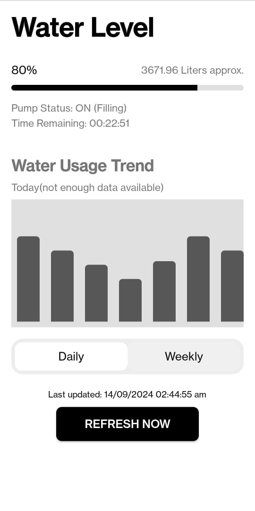

# 💧 Smart Water Level Monitoring System with ESP8266 and Android App

## 🌊 Introduction

This project implements a smart water level monitoring system using an ESP8266 microcontroller, an HC-SR04 ultrasonic sensor, and an Android application. It accurately measures the water level in a tank, displays it on the app, and provides insights into water usage trends. 

## ✨ Features

* **Real-time Water Level Monitoring:**  Constantly measures and displays the water level in the tank as a percentage and approximate volume.
* **Pump Status Detection:**  Intelligently determines if the water pump is filling, draining, or stable based on changes in water level.
* **Estimated Time to Fill/Empty:** Calculates and displays the estimated time remaining for the tank to fill or empty based on the current pump status and fill/drain rate.
* **Historical Water Usage Data:** Provides a basic bar chart visualization of water usage trends over the past 7 days (can be expanded for more detailed analysis).
* **User-Friendly Android App:** An intuitive Android app displays the water level, pump status, time remaining, and historical data in a clear and accessible format.
* **Firebase Realtime Database Integration:**  Utilizes Firebase to store and retrieve sensor data, enabling remote monitoring and data logging.
* **NTP Time Synchronization:**  Ensures accurate timestamps for data logging by synchronizing the ESP8266 with an NTP server.

## 🛠️ Technologies Used

### Hardware:

* **[ESP8266 NodeMCU](https://www.espressif.com/en/products/socs/esp8266):**  A low-cost Wi-Fi microcontroller with built-in TCP/IP stack.
* **[HC-SR04 Ultrasonic Sensor](https://www.makerguides.com/hc-sr04-ultrasonic-distance-sensor-tutorial/):** Measures distance using ultrasonic waves.
* **Jumper Wires:**  For connecting the components.
* **Breadboard (optional):**  For prototyping.

### Software:

* **[Arduino IDE](https://www.arduino.cc/en/software):** For programming the ESP8266.
* **[Firebase](https://firebase.google.com/):**  A cloud platform for data storage, user authentication, and more.
* **[Android Studio](https://developer.android.com/studio):**  The official IDE for Android app development.
* **[Java](https://www.java.com/en/):** The programming language used for the Android app.

## ⚙️ Circuit Diagram

 

## 📱 Android Application Interface

## 💻 Code Overview

### 1. ESP8266 Code (ino file)

* **Initialization:** Sets up Wi-Fi connection, connects to Firebase, and configures sensor pins.
* **Distance Measurement:** Reads the distance from the HC-SR04 sensor.
* **Time Synchronization:** Obtains the current time using NTP.
* **Data Formatting:** Formats the sensor data and timestamps.
* **Firebase Update:** Sends the sensor data (distance, timestamp) to Firebase Realtime Database.

### 2. Android App Code (MainActivity.java)

* **UI Initialization:** Initializes the UI elements (ProgressBar, TextViews).
* **Firebase Data Retrieval:** Fetches the latest sensor data from Firebase.
* **Data Processing:** 
    * Calculates the water level percentage based on the sensor reading and tank dimensions.
    * Determines the pump status (filling, draining, stable) by comparing recent sensor readings.
    * Estimates the time remaining for the tank to fill or empty.
* **UI Update:** Updates the UI elements with the processed data.

## 🚀 Getting Started

### 1. Hardware Setup

1. Connect the HC-SR04 sensor to the ESP8266:
   - **VCC:** Connect to 5V on ESP8266.
   - **GND:** Connect to GND on ESP8266.
   - **TRIG:** Connect to D1 (GPIO5) on ESP8266.
   - **ECHO:** Connect to D2 (GPIO4) on ESP8266. 
2. (Optional) Use a breadboard for easier connections.

### 2. Software Setup

1. **Install Arduino IDE:** Download and install the Arduino IDE from the official website.
2. **Install ESP8266 Board Support:** Follow instructions to add ESP8266 support to the Arduino IDE.
3. **Install Firebase ESP8266 Library:** Search for and install the "Firebase ESP8266 Client" library in the Arduino IDE Library Manager. 
4. **Configure Firebase Project:**
   - Create a Firebase project in the Firebase console.
   - Enable Realtime Database for your project.
   - Go to **Project settings > Service accounts > Firebase Admin SDK** and generate a private key.
   - Copy the private key JSON data.
   - In your Arduino code, replace the `FIREBASE_HOST` and `FIREBASE_AUTH` placeholders with your Firebase project's details (host and private key).
5. **Upload Code to ESP8266:** Connect the ESP8266 to your computer and upload the ino file. 
6. **Build and Install Android App:** 
   - Open the Android project in Android Studio.
   - Connect your Android device or start an emulator.
   - Build and install the app on your device.
   - (Make sure to configure the Firebase details in the Android project as well if needed).

## 📊 Future Enhancements

* **Advanced Data Visualization:** Implement a more detailed chart or graph to visualize water usage trends over longer periods.
* **Alerts and Notifications:**  Add the ability to send alerts (e.g., via SMS or email) when the water level reaches certain thresholds or if the pump malfunctions.
* **User Authentication and Control:** Implement user authentication and allow users to control the water pump remotely through the app.
* **Integration with Smart Home Systems:** Explore integration with other smart home systems for automated water management. 

## 🤝 Contributing

Contributions are welcome! Feel free to submit pull requests to improve the project.

## 📞 Contact

* **[GitHub Profile](https://github.com/Vinitrajputt)**
* **[LinkedIn Profile](https://www.linkedin.com/in/vinitrajputt/)**

## ©️ License

This project is licensed under the [Apache 2.0 License](LICENSE).
